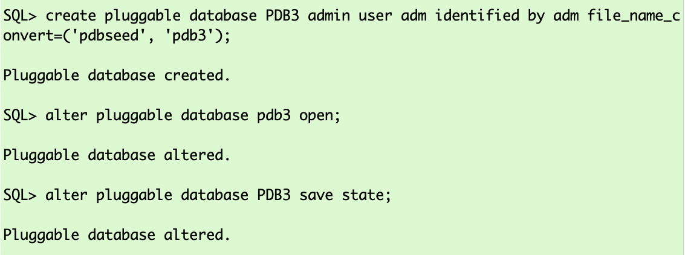

# Prepare Target

## Introduction

In this lab, you will create the target PDB and a few additional objects.

Estimated Time: 15 minutes

### Objectives

- Initialize a new target PDB.

### Prerequisites

This lab assumes you have:

- Connected to the Hands On Lab

## Task 1: Open Terminal Window and Create Three Directories

Open two terminal Windows by clicking on the Terminal icon


For better visibility the source database will use a light blue and the target database a light green background.<br>
Activate the target terminal window and create 3 directories; one for the Data Pump dump file, another one for the SOURCE and the third directory for the TARGET files.

  ```
    <copy>
    mkdir -p /home/oracle/DP/DUMP /home/oracle/XTTS/SOURCE/tmp /home/oracle/XTTS/TARGET/tmp
    </copy>
  ```


## Task 2: Set the Target Environment and Start SQL*Plus


  ```
    <copy>
    . cdb3
    sqlplus / as sysdba 

    </copy>
  ```


## Task 3: In SQL*Plus Create the Target PDB
When creating a PDB the admin user needs to exist. You can delete it later on if desired. Once the PDB3 is created you need to start it up.
  ```
    <copy>
    create pluggable database PDB3 admin user adm identified by adm file_name_convert=('pdbseed', 'pdb3');
    alter pluggable database pdb3 open;
    alter pluggable database PDB3 save state;

    </copy>
  ```




## Task 4: In SQL*Plus Create the Database Directory Used by Data Pump
 and create some additional objects for the migration.

  ```
    <copy>    
		alter session set container=PDB3;
		CREATE OR REPLACE DIRECTORY "XTTS_METADATA_DIR" AS '/home/oracle/XTTS/DUMP/';
    exit;
    </copy>
  ```


You may now *proceed to the next lab*.


## Acknowledgements
* **Author** - Klaus Gronau
* **Contributors** -  
* **Last Updated By/Date** - Klaus Gronau, June 2023
