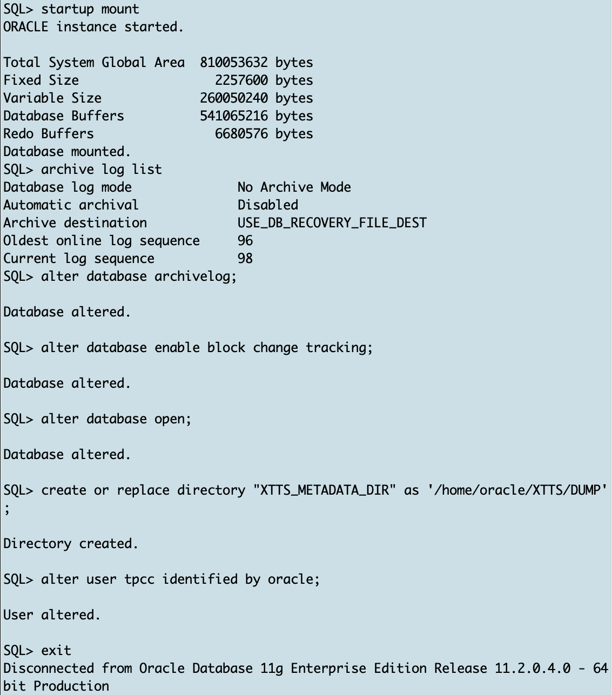

# Prepare source 

## Introduction

In this lab, you will enable archive logging on source database and create the database directory for Data Pump export.

Estimated Time: 5 minutes

### Objectives

- Enable archive logging on source database

### Prerequisites

This lab assumes you have:

- Connected to the lab

## Task 1: Open Terminal Window, Create OS Source Directory and Unzip XTTS ZIP File (SOURCE)

### Open Terminal Window 
Open another terminal windows by clicking on the "Terminal" icon. <br> 
Use this second terminal window to execute all commands related to the __source__ database.


All following screenshots related to the __source__ will have a __light blue__ background color.


### Create OS Directories (SOURCE)
Activate the source terminal window and create three directories; one for the Data Pump metadata dump file, another one as XTTS source and a third directory for RMAN backup/restore files.

  ```
    <copy>
    mkdir -p /home/oracle/XTTS/SOURCE/tmp 
    </copy>
  ```


  ```
    <copy>
    mkdir -p /home/oracle/XTTS/DUMP
    </copy>
  ```


  ```
    <copy>
    mkdir -p /home/oracle/XTTS/RMAN
    </copy>
  ```


### Unzip XTTS ZIP file (SOURCE)

  ```
    <copy>
    cd /home/oracle/XTTS/SOURCE/
    </copy>
  ```


  ```
    <copy>
    unzip /home/oracle/XTTS/rman_xttconvert_VER4.3.zip
    </copy>
  ```


## Task 2: Set the Source Database Environment (SOURCE)

Activate source terminal window, set the source environment and start SQL*Plus:

  ```
    <copy>
    . upgr
    </copy>
 ```


  ```
    <copy>
    sqlplus / as sysdba
    </copy>
 ```


## Task 3: Configure Source Database (SOURCE)
Enable source database archive logging and create the database directory for Data Pump export. Also alter the TPCC user's password:


  ```
    <copy>
    startup mount
    archive log list
    alter database archivelog;
    alter database enable block change tracking;
    alter database open;
    create or replace directory "XTTS_METADATA_DIR" as '/home/oracle/XTTS/DUMP';
    alter user tpcc identified by oracle;
    exit
    </copy>

    Hit ENTER/RETURN to execute ALL commands.
  ```



You might also consider enabling __Block Change Tracking (BCT)__ using the command "alter database enable block change tracking".

## Task 4: Configuring Default RMAN Settings (SOURCE)
The next parameters you're going to set for RMAN work well in the lab. For your environment you might have to adopt them by increasing parallelism, the backup destination etc.

On source start the rman console: 

  ```
    <copy>
     rman target /
    </copy>
  ```

Please be aware:
in RMAN terminology the target database identifies the database which you're going to back up - so in the migration terminology the source database

  ```
    <copy>
     configure default device type to disk;
     configure  device type disk parallelism 8;
     exit;
    </copy>

    Hit ENTER/RETURN to execute ALL commands.
  ```


You may now *proceed to the next lab*.


## Acknowledgements
* **Author** - Klaus Gronau
* **Contributors** -  
* **Last Updated By/Date** - Klaus Gronau, June 2023
