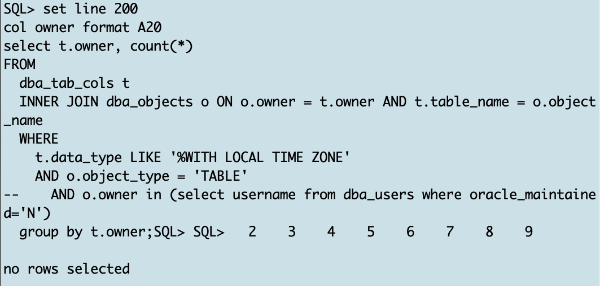

# XTTS PreChecks on Source Database

## Introduction

In this lab, you will execute common XTTS pre-checks in SQL*Plus.

Estimated Time: 15 minutes

### Objectives

- Recommended checks for XTTS.


### Prerequisites

This lab assumes you have:

- Connected to the Hands On Lab
- A terminal window open on source.
- Another terminal window open on target
- Prepared the source
- Prepared the target

## Task 0: Transportable Tablespace Method Supported by Source and Target OS Platforms
Before you begin check on source database if the OS you want to migrate your database to is supported by TTS. <br>
By the way, the platform_id for the target Linux platform is 13, so let's see if it is supported to use XTTS:
  ```
    <copy>
    col platform_name format A20
    set line 200
    set pages 999
    select * from v$transportable_platform 
    where platform_id=13 
    order by platform_id;
    </copy>
  ```


## Task 1: DBTIMEZONE
You should always check that your SOURCE and TARGET database are located in the same timezone. 
Open on source and target SQL*Plus and execute:
  ```
    <copy>
    SELECT   DBTIMEZONE FROM   dual;

    </copy>
  ```


You'll see, in our example source and target databases are in different timezones. This might cause issues when your source database tables have columns with "__TimeStamp with Local Time Zone__ (TSLTZ)". You can execute the next query to see if the source database uses these data types: 

  ```
    <copy>
    set line 200
    col owner format A20
    select t.owner, count(*)
    FROM
      dba_tab_cols t
      INNER JOIN dba_objects o ON o.owner = t.owner AND t.table_name = o.object_name
      WHERE
        t.data_type LIKE '%WITH LOCAL TIME ZONE' 
        AND o.object_type = 'TABLE' 
--        AND o.owner in (select username from dba_users where oracle_maintained='N')
      group by t.owner;

    </copy>
  ```

In the Hands-On-Lab there are no TSLTZ data types used. So no need to sync both DBTIMEZONEs or to handle data manually with expdp/impdp.

## Task 2: Source and Target Character Sets 
The source and target database must use compatible database character sets.

  ```
    <copy>
     col parameter format a35
     col VALUE format a35
     set pages 999
     set line 200
     select * from v$nls_parameters;

    </copy>
  ```
* Details about "[General Limitations on Transporting Data](https://docs.oracle.com/en/database/oracle/oracle-database/19/spucd/general-limitations-on-transporting-data.html#GUID-28800719-6CB9-4A71-95DD-4B61AA603173)" are mentioned in the manual


## Task 3: XTTS Tablespace Violations on Source  
For transportable tablespaces another requirement is that all tablespaces you're going to transport are self contained.
In this hands on lab you're going to transport the two tablespaces "TPCCTAB" and "USERS". So let's check if they are self contained:

  ```
    <copy>
     EXEC SYS.DBMS_TTS.TRANSPORT_SET_CHECK ('TPCCTAB,USERS',True,True);
     SELECT * FROM transport_set_violations;

    </copy>
  ```


## Task 4: User Data in SYSTEM/SYSAUX Tablespace on Source
As SYSTEM and SYSAUX tablespaces are not copied from source to target, it's good practice to check if they might accidentally contain user data:

  ```
    <copy>
     set line 200
     col owner format A20
     col table_name format A50
     select owner, table_name, temporary from dba_tables where 
     owner not in ('WMSYS','XDB','SYSTEM','SYS','LBACSYS','OUTLN','DBSNMP','APPQOSSYS')
     -- (select username from dba_users 
     -- where oracle_maintained='Y') 
     and tablespace_name in ( 'SYSTEM', 'SYSAUX');

    </copy>
  ```


## Task 5: User Indexes in SYSTEM/SYSAUX Tablespace on Source
Same check as in the previous task but this time for user indexes

  ```
    <copy>
     set line 200
     col owner format A20
     col table_name format A50
     col index_name format A50
     select  owner, table_name,index_name from dba_indexes
     where owner not in ('WMSYS','XDB','SYSTEM','SYS','LBACSYS','OUTLN','DBSNMP','APPQOSSYS')
     -- owner not in (select username from dba_users where oracle_maintained='Y') 
     and tablespace_name in ( 'SYSTEM', 'SYSAUX') order by 1,2;

    </copy>
  ```


## Task 6: IOT Tables
IOT tables might get corrupted during XTTS copy when copying to HP platforms. 
* [Corrupt IOT when using Transportable Tablespace to HP from different OS (Doc ID 1334152.1) ](https://support.oracle.com/epmos/faces/DocumentDisplay?id=1334152.1&displayIndex=1)

  ```
    <copy>
     set line 200
     set pages 999
     col owner format a20
     col table_name format a35
     select owner,table_name,iot_type from dba_tables where iot_type like '%IOT%' 
     and table_name not like 'DR$%' 
     -- and owner not in (select username from dba_users where oracle_maintained='Y')
     and owner not in ('WMSYS','XDB','SYSTEM','SYS','LBACSYS','OUTLN','DBSNMP','APPQOSSYS')
     ;

    </copy>
  ```


You can ignore this output because you're not moving to HP platform.

## Task 7: Binary XMLTYPE Columns
In versions prior 12.2 metadata imports failed when having tables with XMLTYPE columns. You need to exclude them from the metadata export and handle the content manually during the downtime. A check if you have XML types stored in your database is:

  ```
    <copy>
    select distinct p.tablespace_name from dba_tablespaces p, dba_xml_tables x, dba_users u, all_all_tables t where t.table_name=x.table_name and t.tablespace_name=p.tablespace_name and x.owner=u.username;
    select distinct p.tablespace_name from dba_tablespaces p, dba_xml_tab_cols x, dba_users u, all_all_tables t where t.table_name=x.table_name and t.tablespace_name=p.tablespace_name and x.owner=u.username;

    </copy>
  ```


Only XML data in SYSAUX tablespace which you're not going to migrate. So ignore it.

* [Is it supported to do a Transport Tablespace (TTS) Import with Data Pump on a tablespace with binary XML objects ? (Doc ID 1908140.1) ](https://support.oracle.com/epmos/faces/DocumentDisplay?id=1908140.1&displayIndex=1)


## Task 8: Global Temporary Tables
Global temporary tables do not belong to any tablespace, so they are not transported to the target database. Let's see if we have some global temporary tables and who might own them:


  ```
    <copy>
     SELECT table_name FROM dba_tables WHERE temporary= 'Y'
     and owner not in ('WMSYS','XDB','SYSTEM','SYS','LBACSYS','OUTLN','DBSNMP','APPQOSSYS')
     -- owner not in (select username from dba_users where oracle_maintained='Y') 
     ;

    </copy>
  ```


There are no global temporary tables in our lab. When you have them in your database, you can migrate them using Data Pump export/import or generate the metadata from these tables and created them in the target database.


You may now *proceed to the next lab*.


## Acknowledgements
* **Author** - Klaus Gronau
* **Contributors** -  
* **Last Updated By/Date** - Klaus Gronau, June 2023
