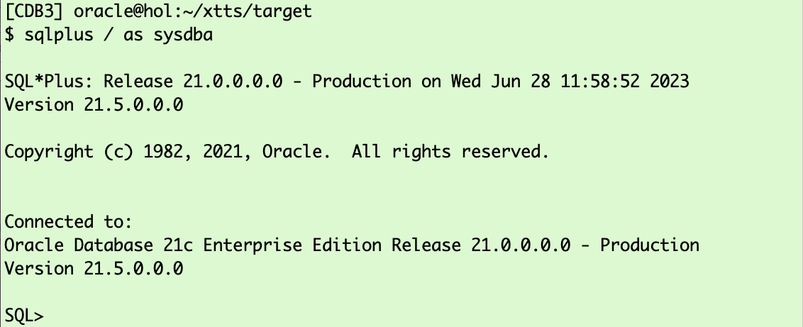
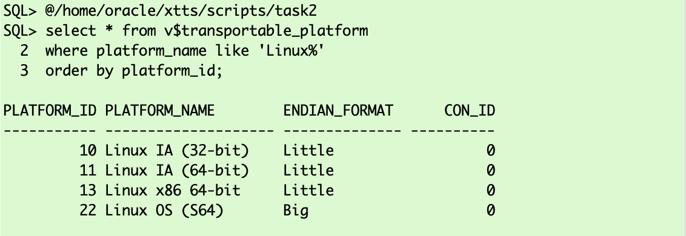
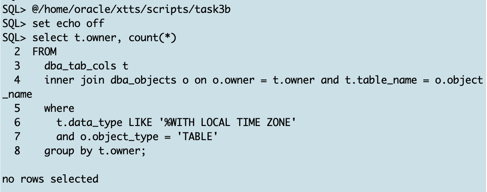

# XTTS PreChecks on the Source Database

## Introduction

In this lab, you will execute common XTTS pre-checks in SQL*Plus. Each task will also contain the information if you have to execute this step on source, target, or both.

Estimated Time: 15 minutes

### Objectives

- Recommended checks for XTTS.


### Prerequisites

This lab assumes you have:

- Connected to the lab
- A terminal window open on the source.
- Another terminal window open on the target
- Prepared the source
- Prepared the target

## Task 1: Start SQL*Plus (SOURCE and TARGET)

1. Source

    ```
    <copy>
    sqlplus / as sysdba
    </copy>
    ```

2. Target

    ```
    <copy>
    sqlplus / as sysdba
    </copy>
    ```

| Source | Target |
| :-------- | :-----|
|  |  |
{: title="SQL*Plus Output from Source and Target"}

## Task 2: Transportable Tablespace Method Supported by Source and Target OS Platforms (SOURCE and TARGET) 

Before you begin, check on source if the OS you want to migrate your database to, supports datafile conversion. <br>
Also, check on target if the OS you want to migrate from, supports datafile conversion.

So, execute on __source__ and __target__:

  ```
   <copy>
   @/home/oracle/xtts/scripts/task2
   </copy>
  ```

<details>
 <summary>*click here to see the SQL Statement*</summary>

  ``` text
    select * from v$transportable_platform 
    where platform_name like 'Linux%' 
    order by platform_id;

  ```
</details>

| Source | Target |
| :-------- | :-----|
|||
{: title="Transportable Tablespace Method Supported on Source and Target"}


## Task 3: Database Timezone (SOURCE and TARGET)
You should always check that your source and target database use the same database timezone (dbtimezone). 

Execute on __source__ and __target__:
  ```
    <copy>
    @/home/oracle/xtts/scripts/task3a
    </copy>
  ```
<details>
 <summary>*click here to see the SQL statement*</summary>

  ``` text
select dbtimezone from dual;
  ```
</details>


| Source | Target |
| :-------- | :-----|
|||
{: title="DBTIMEZONE Output from Source and Target"}

In this lab, there are no tables with "__TimeStamp with Local Time Zone__ (TSLTZ)" columns. No further action is needed. Had there been such columns, you must change one of the databases or move the offending tables using a regular Data Pump export/import. 


### CHECK for TimeStamp with Local Time Zone (TSLTZ) Data Type (SOURCE)
As both time zones differ, check now if your source database has tables having columns with "__TimeStamp with Local Time Zone__ (TSLTZ)": 

  ```
    <copy>
    @/home/oracle/xtts/scripts/task3b
    </copy>
  ```

<details>
 <summary>*click here to see the SQL statement*</summary>


  ``` text
    select t.owner, count(*)
    from
      dba_tab_cols t
      inner join dba_objects o on o.owner = t.owner and t.table_name = o.object_name
      where
        t.data_type like '%WITH LOCAL TIME ZONE' 
        and o.object_type = 'TABLE' 
      group by t.owner;

  ```
</details>
| Source | Target |
| :-------- | :-----|
|| n/a |
{: title="Tables on Source with LOCAL TIMEZONE Data Types"}


In the lab, there are no TSLTZ data types used. So there is no need to sync both DBTIMEZONEs or handle data manually with expdp/impdp.

## Task 4: Character Sets (SOURCE and TARGET)
The source and target database must use compatible database character sets. 
* Details about compatible character sets "[General Limitations on Transporting Data](https://docs.oracle.com/en/database/oracle/oracle-database/19/spucd/general-limitations-on-transporting-data.html#GUID-28800719-6CB9-4A71-95DD-4B61AA603173)" are mentioned in the documentation.

So execute the next script again on __source__ and __target__:

  ```
    <copy>
     @/home/oracle/xtts/scripts/task4
    </copy>
  ```

<details>
 <summary>*click here to see the SQL statement*</summary>


  ``` text
select parameter,value from v$nls_parameters
where parameter like '%CHARACTERSET';
  ```
</details>

| Source | Target |
| :-------- | :-----|
|||
{: title="Character Set Output from Source and Target"}


Both character sets in the lab match, and no further action is needed. 


## Task 5: XTTS Tablespace Violations (SOURCE) 
For transportable tablespaces, another requirement is that all tablespaces you're going to transport are self-contained.
In this lab, you will transport the tablespaces "TPCCTAB" and "USERS". So let's check if they are self-contained:

  ```
    <copy>
    @/home/oracle/xtts/scripts/task5
    </copy>
  ```

<details>
 <summary>*click here to see the SQL statement*</summary>


  ``` text
     exec sys.dbms_tts.transport_set_check ('TPCCTAB,USERS',True,True);
     select * from transport_set_violations;

  ```
</details>


## Task 6: User Data in SYSTEM/SYSAUX Tablespace (SOURCE)
It's good practice to check if SYSTEM and SYSAUX tablespaces might accidentally contain user data:

  ```
    <copy>
     @/home/oracle/xtts/scripts/task6
    </copy>
  ```

<details>
 <summary>*click here to see the SQL statement*</summary>


  ``` text
     select owner, table_name, temporary from dba_tables where 
     owner not in ('WMSYS','XDB','SYSTEM','SYS','LBACSYS','OUTLN','DBSNMP','APPQOSSYS')
     -- (select username from dba_users 
     -- where oracle_maintained='Y') 
     and tablespace_name in ( 'SYSTEM', 'SYSAUX');
  ```
</details>


If there were user data in the SYSTEM or SYSAUX tablespaces, it would now be the right moment to correct this.

## Task 7: User Indexes in SYSTEM/SYSAUX Tablespace (SOURCE)
Same check as in the previous task but this time for user indexes

  ```
    <copy>
     @/home/oracle/xtts/scripts/task7
    </copy>
  ```

<details>
 <summary>*click here to see the SQL statement*</summary>


  ``` text
     select  owner, table_name,index_name from dba_indexes
     where owner not in ('WMSYS','XDB','SYSTEM','SYS','LBACSYS','OUTLN','DBSNMP','APPQOSSYS')
     -- owner not in (select username from dba_users where oracle_maintained='Y') 
     and tablespace_name in ( 'SYSTEM', 'SYSAUX') order by 1,2;

  ```
</details>


<if type="KgR">
## Task 8: IOT Tables (SOURCE)
IOT tables might get corrupted during XTTS copy when copying, especially to HP platforms. 
* [Corrupt IOT when using Transportable Tablespace to HP from different OS (Doc ID 1334152.1) ](https://support.oracle.com/epmos/faces/DocumentDisplay?id=1334152.1&displayIndex=1)
Even though you migrate to Linux, it's worth checking and bearing in mind.


  ```
    <copy>
     @/home/oracle/xtts/scripts/task8
    </copy>
  ```


<details>
 <summary>*click here to see the SQL statement*</summary>


  ``` text
     select owner,table_name,iot_type from dba_tables where iot_type like '%IOT%' 
     and table_name not like 'DR$%' 
     -- and owner not in (select username from dba_users where oracle_maintained='Y')
     and owner not in ('WMSYS','XDB','SYSTEM','SYS','LBACSYS','OUTLN','DBSNMP','APPQOSSYS');

  ```
</details>


You can ignore this output because you're not moving to HP platform.

## Task 9: Binary XMLTYPE Columns (SOURCE)
In Oracle Database 12.1 and earlier, you can't move tables with XMLTYPEs using transportable tablespaces. Ensure there are no such tables: 

  ```
    <copy>
     @/home/oracle/xtts/scripts/task9
    </copy>
  ```


<details>
 <summary>*click here to see the SQL statement*</summary>


  ``` text
    select distinct p.tablespace_name from dba_tablespaces p, dba_xml_tables x, dba_users u, all_all_tables t 
    where t.table_name=x.table_name 
    and t.tablespace_name=p.tablespace_name 
    and x.owner=u.username;

    select distinct p.tablespace_name from dba_tablespaces p, dba_xml_tab_cols x, dba_users u, all_all_tables t 
    where t.table_name=x.table_name 
    and t.tablespace_name=p.tablespace_name 
    and x.owner=u.username;

  ```
</details>


Only XML data in SYSAUX tablespace, which you're not going to migrate. So ignore them. Had there been such tables, you must move them using Data Pump export/import.

* [Is it supported to do a Transport Tablespace (TTS) Import with Data Pump on a tablespace with binary XML objects ? (Doc ID 1908140.1) ](https://support.oracle.com/epmos/faces/DocumentDisplay?id=1908140.1&displayIndex=1)


## Task 10: Global Temporary Tables (SOURCE)
Global temporary tables do not belong to any tablespace, so they Data Pump does not transport them to the target database. Let's see if you have some global temporary tables and who might own them:


  ```
    <copy>
     @/home/oracle/xtts/scripts/task10
    </copy>
  ```

<details>
 <summary>*click here to see the SQL statement*</summary>


  ``` text
     select table_name FROM dba_tables WHERE temporary= 'Y'
     and owner not in ('WMSYS','XDB','SYSTEM','SYS','LBACSYS','OUTLN','DBSNMP','APPQOSSYS')
     -- owner not in (select username from dba_users where oracle_maintained='Y') 
     ;

  ```
</details>


There are no global temporary tables in our lab. When you have them in your database, you can migrate them using Data Pump export/import or generate the metadata from these tables and create them in the target database.

</if>

## Task 8: Exit SQL*Plus (SOURCE and TARGET)

Execute on __source__ and __target__:

  ```
    <copy>
     exit;
    </copy>
  ```
Output on the __source__:


and the output on the __target__


You may now *proceed to the next lab*.


## Acknowledgments
* **Author** - Klaus Gronau
* **Contributors** Mike Dietrich, Daniel Overby Hansen  
* **Last Updated By/Date** - Klaus Gronau, June 2023
