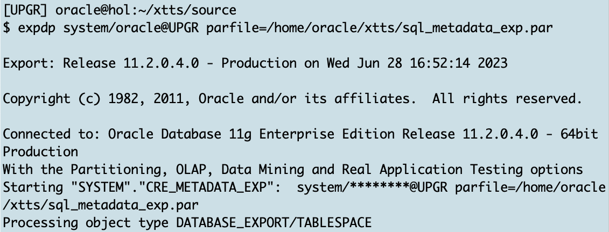
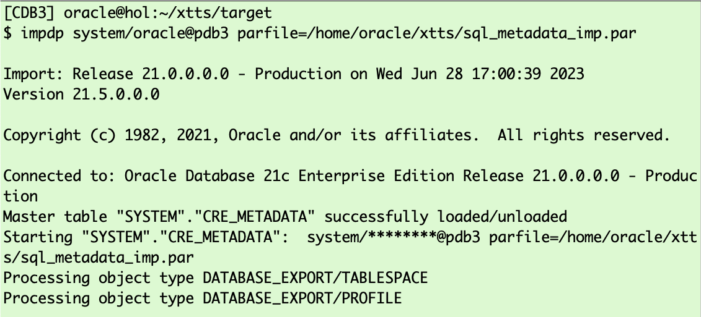
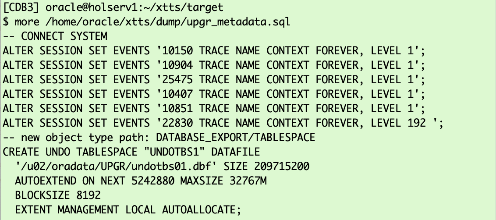

# Checks  

## Introduction

This final lab is listing some checks you might perform after a migration. It also gives you a quick way how to create a metadata SQL output for all objects in your database.

Estimated Time: 15 minutes

### Objectives

- Export metadata using Data Pump
- Import metadata using Data Pump


### Prerequisites

This lab assumes you have:

- Connected to the lab
- A terminal window open on source
- Another terminal window open on target
- Prepared the source
- Successfully executed initial backup (prepare phase)
- Successfully executed initial restore (prepare phase)
- Successfully executed incremental backup(s) (roll forward phase)
- Successfully executed incremental restore(s) (roll forward phase)
- Successfully executed final backup (transport phase)
- Successfully executed final restore (transport phase)
- executed the TTS expdp and impdp (transport phase)


## Task 1: Metadata Export (SOURCE)
Sometimes you need to analyze the root cause of an import failure. Did you know, you can create the metadata of your database using Data Pump?

1. Prepared Export Data Pump Parameter File (SOURCE)

    ```
    <copy>
    cat /home/oracle/xtts/sql_metadata_exp.par
    </copy>
    ```

    

    <details>
    <summary>*click here if you want to see the Data Pump export parameter file and a short description*</summary>


    | Parameter | Comment |
    | :-------- | :-----|
    | directory=XTTS\_METADATA\_DIR | Specifies the default location to which export can write the dump file set and the log file |
    | dumpfile=upgr\_metadata\_%U.dmp | Is the name of the dump file |
    | cluster=N | Restricts to execute the current job on the node where it was started  |
    | job_name=cre\_metadata\_exp | Specifies a job name for the metadata export  |
    | content=metadata\_only | Exports only metadata  |
    | filesize=10737418240 | Restricts the export of the Data Pump export to given amount of bytes  |
    | logfile=cre\_metadata\_exp.log | This parameter specifies the name for the log file of the export job. |
    | full=y | FULL specifies that you want to perform a full database mode export  |
    | parallel=1 | In 11.2 metadata is only exported with parallelism of 1  |
    {: title="Data Pump Metadata Export Parameter File"}

    </details>

2. Execute Export Data Pump (SOURCE) </br>
Execute a metadata export using this par file:

    ```
    <copy>
    expdp system/oracle@UPGR parfile=/home/oracle/xtts/sql_metadata_exp.par
    </copy>
    ```

    

    <details>
    <summary>*click here to see the full metadata EXPDP log file*</summary>

    ``` text
    [UPGR] oracle@hol:~/xtts/source
    $ expdp system/oracle@UPGR parfile=/home/oracle/xtts/sql_metadata_exp.par

    Export: Release 11.2.0.4.0 - Production on Wed Jun 28 16:52:14 2023

    Copyright (c) 1982, 2011, Oracle and/or its affiliates.  All rights reserved.

    Connected to: Oracle Database 11g Enterprise Edition Release 11.2.0.4.0 - 64bit Production
    With the Partitioning, OLAP, Data Mining and Real Application Testing options
    Starting "SYSTEM"."CRE_METADATA_EXP":  system/********@UPGR parfile=/home/oracle/xtts/sql_metadata_exp.par
    Processing object type DATABASE_EXPORT/TABLESPACE
    Processing object type DATABASE_EXPORT/PROFILE
    Processing object type DATABASE_EXPORT/SYS_USER/USER
    Processing object type DATABASE_EXPORT/SCHEMA/USER
    Processing object type DATABASE_EXPORT/ROLE
    Processing object type DATABASE_EXPORT/GRANT/SYSTEM_GRANT/PROC_SYSTEM_GRANT
    Processing object type DATABASE_EXPORT/SCHEMA/GRANT/SYSTEM_GRANT
    Processing object type DATABASE_EXPORT/SCHEMA/ROLE_GRANT
    Processing object type DATABASE_EXPORT/SCHEMA/DEFAULT_ROLE
    Processing object type DATABASE_EXPORT/SCHEMA/TABLESPACE_QUOTA
    Processing object type DATABASE_EXPORT/RESOURCE_COST
    Processing object type DATABASE_EXPORT/TRUSTED_DB_LINK
    Processing object type DATABASE_EXPORT/SCHEMA/SEQUENCE/SEQUENCE
    Processing object type DATABASE_EXPORT/DIRECTORY/DIRECTORY
    Processing object type DATABASE_EXPORT/DIRECTORY/GRANT/OWNER_GRANT/OBJECT_GRANT
    Processing object type DATABASE_EXPORT/CONTEXT
    Processing object type DATABASE_EXPORT/SCHEMA/PUBLIC_SYNONYM/SYNONYM
    Processing object type DATABASE_EXPORT/SCHEMA/SYNONYM
    Processing object type DATABASE_EXPORT/SCHEMA/TYPE/TYPE_SPEC
    Processing object type DATABASE_EXPORT/SYSTEM_PROCOBJACT/PRE_SYSTEM_ACTIONS/PROCACT_SYSTEM
    Processing object type DATABASE_EXPORT/SYSTEM_PROCOBJACT/PROCOBJ
    Processing object type DATABASE_EXPORT/SYSTEM_PROCOBJACT/POST_SYSTEM_ACTIONS/PROCACT_SYSTEM
    Processing object type DATABASE_EXPORT/SCHEMA/PROCACT_SCHEMA
    Processing object type DATABASE_EXPORT/SCHEMA/TABLE/TABLE
    Processing object type DATABASE_EXPORT/SCHEMA/TABLE/PRE_TABLE_ACTION
    Processing object type DATABASE_EXPORT/SCHEMA/TABLE/GRANT/OWNER_GRANT/OBJECT_GRANT
    Processing object type DATABASE_EXPORT/SCHEMA/TABLE/COMMENT
    Processing object type DATABASE_EXPORT/SCHEMA/PACKAGE/PACKAGE_SPEC
    Processing object type DATABASE_EXPORT/SCHEMA/FUNCTION/FUNCTION
    Processing object type DATABASE_EXPORT/SCHEMA/PROCEDURE/PROCEDURE
    Processing object type DATABASE_EXPORT/SCHEMA/PACKAGE/COMPILE_PACKAGE/PACKAGE_SPEC/ALTER_PACKAGE_SPEC
    Processing object type DATABASE_EXPORT/SCHEMA/FUNCTION/ALTER_FUNCTION
    Processing object type DATABASE_EXPORT/SCHEMA/PROCEDURE/ALTER_PROCEDURE
    Processing object type DATABASE_EXPORT/SCHEMA/TABLE/INDEX/INDEX
    Processing object type DATABASE_EXPORT/SCHEMA/TABLE/CONSTRAINT/CONSTRAINT
    Processing object type DATABASE_EXPORT/SCHEMA/TABLE/INDEX/STATISTICS/INDEX_STATISTICS
    Processing object type DATABASE_EXPORT/SCHEMA/VIEW/VIEW
    Processing object type DATABASE_EXPORT/SCHEMA/VIEW/GRANT/OWNER_GRANT/OBJECT_GRANT
    Processing object type DATABASE_EXPORT/SCHEMA/VIEW/COMMENT
    Processing object type DATABASE_EXPORT/SCHEMA/PACKAGE_BODIES/PACKAGE/PACKAGE_BODY
    Processing object type DATABASE_EXPORT/SCHEMA/TABLE/CONSTRAINT/REF_CONSTRAINT
    Processing object type DATABASE_EXPORT/SCHEMA/TABLE/STATISTICS/TABLE_STATISTICS
    Processing object type DATABASE_EXPORT/SCHEMA/TABLE/POST_TABLE_ACTION
    Processing object type DATABASE_EXPORT/SCHEMA/TABLE/TRIGGER
    Processing object type DATABASE_EXPORT/SCHEMA/POST_SCHEMA/PROCACT_SCHEMA
    Processing object type DATABASE_EXPORT/AUDIT
    Master table "SYSTEM"."CRE_METADATA_EXP" successfully loaded/unloaded
    ******************************************************************************
    Dump file set for SYSTEM.CRE_METADATA_EXP is:
      /home/oracle/xtts/dump/upgr_metadata_01.dmp
    Job "SYSTEM"."CRE_METADATA_EXP" successfully completed at Wed Jun 28 16:53:02 2023 elapsed 0 00:00:47

    [UPGR] oracle@hol:~/xtts/source
    $
    ```
    </details>


## Task 2: Generate Metadata SQL Using Import (TARGET)

1. Prepared Metadata SQL Import Parameter File

    ```
    <copy>
    cat /home/oracle/xtts/sql_metadata_imp.par
    </copy>
    ```

    

    <details>
    <summary>*click here if you want to see the Data Pump import parameter file and a short description*</summary>


    | Parameter | Comment |
    | :-------- | :-----|
    | DIRECTORY=XTTS\_METADATA\_DIR | Specifies the default location to which Export can write the dump file set and the log file |
    | DUMPFILE=exp\_metadata.dmp | Is the name of the dump file |
    | logfile=xtts\_export\_metadata.log | This parameter specifies the name for the log file of the export job. |
    | sqlfile=upgr\_metadata.sql | The name of the file containing SQL statements of the metadata  |
    | job\_name=cre\_metadata | The name of the import Data Pump job  |
    {: title="Data Pump Metadata Import SQL Parameter File"}

    </details>

    So you're going to create a SQL file containing all metadata called "upgr\_metadata.sql" located in the database directory "XTTS\_METADATA\_DIR" 


2.  Generating Metadata SQL

    ```
    <copy>
    impdp system/oracle@pdb3 parfile=/home/oracle/xtts/sql_metadata_imp.par
    <copy>
    ```

    

    <details>
    <summary>*click here to see the full metadata IMPDP log file*</summary>

    ``` text
    [CDB3] oracle@hol:~/xtts/target
    $ impdp system/oracle@pdb3 parfile=/home/oracle/xtts/sql_metadata_imp.par

    Import: Release 21.0.0.0.0 - Production on Wed Jun 28 17:00:39 2023
    Version 21.5.0.0.0

    Copyright (c) 1982, 2021, Oracle and/or its affiliates.  All rights reserved.


    Connected to: Oracle Database 21c Enterprise Edition Release 21.0.0.0.0 - Production
    Master table "SYSTEM"."CRE_METADATA" successfully loaded/unloaded
    Starting "SYSTEM"."CRE_METADATA":  system/********@pdb3 parfile=/home/oracle/xtts/sql_metadata_imp.par
    Processing object type DATABASE_EXPORT/TABLESPACE
    Processing object type DATABASE_EXPORT/PROFILE
    Processing object type DATABASE_EXPORT/SYS_USER/USER
    Processing object type DATABASE_EXPORT/SCHEMA/USER
    Processing object type DATABASE_EXPORT/ROLE
    Processing object type DATABASE_EXPORT/GRANT/SYSTEM_GRANT/PROC_SYSTEM_GRANT
    Processing object type DATABASE_EXPORT/SCHEMA/GRANT/SYSTEM_GRANT
    Processing object type DATABASE_EXPORT/SCHEMA/ROLE_GRANT
    Processing object type DATABASE_EXPORT/SCHEMA/DEFAULT_ROLE
    Processing object type DATABASE_EXPORT/SCHEMA/TABLESPACE_QUOTA
    Processing object type DATABASE_EXPORT/RESOURCE_COST
    Processing object type DATABASE_EXPORT/TRUSTED_DB_LINK
    Processing object type DATABASE_EXPORT/SCHEMA/SEQUENCE/SEQUENCE
    Processing object type DATABASE_EXPORT/DIRECTORY/DIRECTORY
    Processing object type DATABASE_EXPORT/DIRECTORY/GRANT/OWNER_GRANT/OBJECT_GRANT
    Processing object type DATABASE_EXPORT/CONTEXT
    Processing object type DATABASE_EXPORT/SCHEMA/TYPE/TYPE_SPEC
    Processing object type DATABASE_EXPORT/SYSTEM_PROCOBJACT/PRE_SYSTEM_ACTIONS/PROCACT_SYSTEM
    Processing object type DATABASE_EXPORT/SYSTEM_PROCOBJACT/PROCOBJ
    Processing object type DATABASE_EXPORT/SYSTEM_PROCOBJACT/POST_SYSTEM_ACTIONS/PROCACT_SYSTEM
    Processing object type DATABASE_EXPORT/SCHEMA/PROCACT_SCHEMA
    Processing object type DATABASE_EXPORT/SCHEMA/TABLE/TABLE
    Processing object type DATABASE_EXPORT/SCHEMA/TABLE/PRE_TABLE_ACTION
    Processing object type DATABASE_EXPORT/SCHEMA/TABLE/GRANT/OWNER_GRANT/OBJECT_GRANT
    Processing object type DATABASE_EXPORT/SCHEMA/TABLE/COMMENT
    Processing object type DATABASE_EXPORT/SCHEMA/PACKAGE/PACKAGE_SPEC
    Processing object type DATABASE_EXPORT/SCHEMA/PROCEDURE/PROCEDURE
    Processing object type DATABASE_EXPORT/SCHEMA/PACKAGE/COMPILE_PACKAGE/PACKAGE_SPEC/ALTER_PACKAGE_SPEC
    Processing object type DATABASE_EXPORT/SCHEMA/PROCEDURE/ALTER_PROCEDURE
    Processing object type DATABASE_EXPORT/SCHEMA/TABLE/INDEX/INDEX
    Processing object type DATABASE_EXPORT/SCHEMA/TABLE/CONSTRAINT/CONSTRAINT
    Processing object type DATABASE_EXPORT/SCHEMA/TABLE/INDEX/STATISTICS/INDEX_STATISTICS
    Processing object type DATABASE_EXPORT/SCHEMA/VIEW/VIEW
    Processing object type DATABASE_EXPORT/SCHEMA/PACKAGE_BODIES/PACKAGE/PACKAGE_BODY
    Processing object type DATABASE_EXPORT/SCHEMA/TABLE/CONSTRAINT/REF_CONSTRAINT
    Processing object type DATABASE_EXPORT/SCHEMA/TABLE/STATISTICS/TABLE_STATISTICS
    Processing object type DATABASE_EXPORT/SCHEMA/TABLE/POST_TABLE_ACTION
    Processing object type DATABASE_EXPORT/SCHEMA/TABLE/TRIGGER
    Processing object type DATABASE_EXPORT/SCHEMA/POST_SCHEMA/PROCACT_SCHEMA
    Processing object type DATABASE_EXPORT/AUDIT
    Job "SYSTEM"."CRE_METADATA" successfully completed at Wed Jun 28 17:01:00 2023 elapsed 0 00:00:15

    [CDB3] oracle@hol:~/xtts/target
    $
    ```
    </details>

    If you want to take a look at the metadata SQL file, you can use this command on __target__:

    ```
    <copy>
    more /home/oracle/xtts/dump/upgr_metadata.sql
    </copy>
    ```

     


## Task  3: Check 
Do you remember that you created a table "object_copy" in "tpcc" at the beginning of the roll forward phase?
You can now check if source and target match using SQL*Plus:

1. Open SQL*Plus (SOURCE)

    ```
    <copy>
    sqlplus tpcc/oracle
    </copy>
    ```

     

2. Open SQL*Plus (TARGET)

    ```
    <copy>
    sqlplus tpcc/oracle@pdb3
    </copy>
    ```

     

3. SQL Statement (SOURCE and TARGET)

    ```
    <copy>
    select count(*) from object_copy;
    </copy>
    ```

    | Output Source | Output Target |
    | :--------: | :-----:|
    |   |  |
    {: title="Compare table on source and target"}

4. Exit SQL*Plus (SOURCE and TARGET)

    ```
    <copy>
    exit
    </copy>
    ```

    Output on __source__:

    

    and output on __target__:

    


## Congratulations! 
You completed all stages of this XTTS lab migrating an Oracle 11g database directly into a 21c PDB successfully!


## Acknowledgements
* **Author** - Klaus Gronau
* **Contributors** Mike Dietrich, Daniel Overby Hansen  
* **Last Updated By/Date** - Klaus Gronau, June 2023
