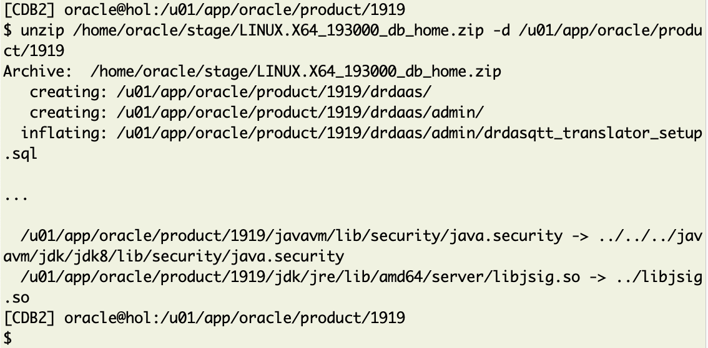
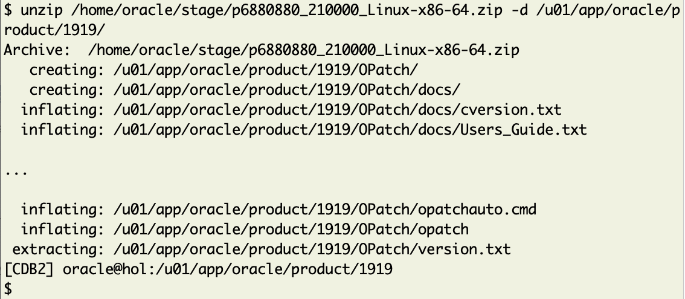
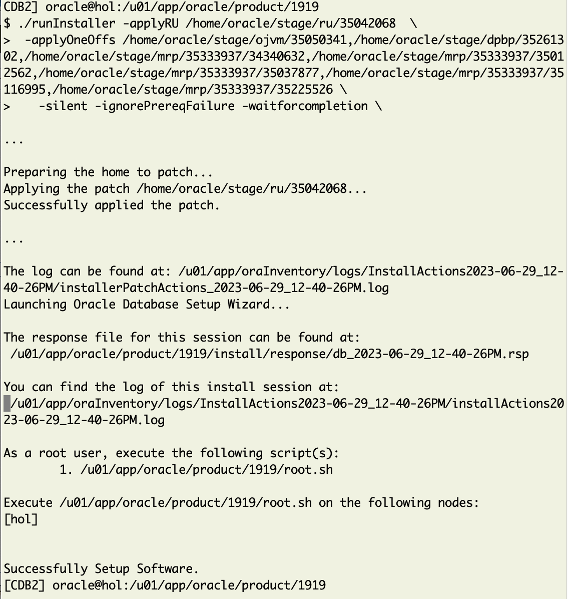

# Lab 1: Installation and Patching

## Introduction 

In this lab, you will install Oracle Database 19.19.0 into a separate home and patch it fully unattended in one operation. 


Out-of-place patching is the preferred method, not only for the Database home but also for the Grid Infrastructure Home.

Estimated Time: 5 minutes (task 2 will run in the background for 25 minutes)

### Objectives

* 19.3.0 base release
* New opatch version
* 19.19.0 Release Update
* 19.19.0 Oracle JVM Bundle
* 19.19.0 Data Pump Bundle Patch
* 19.19.0.0.230516 Monthly Recommended Patch 1 for 19.19.0

### Prerequisites

This lab assumes you have:

- Connected to the lab


## Task 1: Base Release Installation
Create the new Oracle Home for 19.19.0, unzip the base release, and update opatch. 

Start by **double-clicking at the "patching" icon** on the desktop:


It will open an xterm (Terminal Window) with two open tabs.

1. Setting the Environment </br> 
Switch to the tab called "__19.19.0 Home__". 

    

    You set all variables when executing: 

    ```
    <copy>
    . cdb1919
    </copy>
    ```

    

2. Create the new 19.19 Oracle Home Directory

    ```
    <copy>
    mkdir /u01/app/oracle/product/1919
    </copy>
    ```

    

3. Change into 19.19 Oracle_Home

    ```
    <copy>
    cd /u01/app/oracle/product/1919
    </copy>
    ```

    

4. Unzip Base Image </br>
As the next step, unzip the 19.3.0 base image from the staging location into this directory.

    ```
    <copy>
    unzip /home/oracle/stage/LINUX.X64_193000_db_home.zip -d /u01/app/oracle/product/1919
    </copy>
    ```

    

5. OPatch </br> 
Then remove the OPatch directory 

    ```
    <copy>
    rm -rf OPatch
    </copy>
    ```

    

    and unzip the new OPatch from staging into this new Oracle Home. This step is important since older OPatch versions won't have the features you are using today.

    ```
    <copy>
    unzip /home/oracle/stage/p6880880_210000_Linux-x86-64.zip -d /u01/app/oracle/product/1919/
    </copy>
    ```

    


## Task 2: Patch Installation

The patches you are going to install are all unpacked into separate directories.

  ``` text
/home/oracle/stage
├── dpbp
│   ├── 35261302
│   └── PatchSearch.xml
├── mrp
│   ├── 35333937
│   │   ├── 34340632
│   │   ├── 35012562
│   │   ├── 35037877
│   │   ├── 35116995
│   │   └── 35225526
│   └── PatchSearch.xml
├── ojvm
│   ├── 35050341
│   └── PatchSearch.xml
└── ru
    ├── 35042068
    └── PatchSearch.xml
  ```


To install all the patches in one action, you will use the `-applyRU` and `-applyOneOffs` options of the Oracle Universal Installer (OUI). OUI is not yet aware of the MRP concept, so you must reference each individual patch included in the MRP.

You can either copy & paste the entire command (first option) or call a script (second option). Use only __one__ of the next two options, copy the command, and paste it into the "19.19.0 Home" terminal tab.

NOTE: *While the installation is ongoing, please switch to the 19.18 tab and continue with the next lab. You will execute the "root.sh" script in one of the next labs.*

1. Option - Shell Script

<details>
  <summary>*run a shell script (and _only_ run this shell script if you do not want to copy/paste the complete runInstaller command)*</summary>
```text
    First, examine the script.

    <copy>
    cat /home/oracle/patch/install_patch.sh
    </copy>

    Then execute the script.


    <copy>
    sh /home/oracle/patch/install_patch.sh
    </copy>

<details>
 <summary>*Click to see the output*</summary>
  [CDB2] oracle@hol:/u01/app/oracle/product/1919
  $ ./runInstaller -applyRU /home/oracle/stage/ru/35042068  \
  >  -applyOneOffs /home/oracle/stage/ojvm/35050341,/home/oracle/stage/dpbp/35261302,/home/oracle/stage/mrp/35333937/34340632,/home/oracle/stage/mrp/35333937/35012562,/home/oracle/stage/mrp/35333937/35037877,/home/oracle/stage/mrp/35333937/35116995,/home/oracle/stage/mrp/35333937/35225526 \
  >    -silent -ignorePrereqFailure -waitforcompletion \
  >     oracle.install.option=INSTALL_DB_SWONLY \
  >     UNIX_GROUP_NAME=oinstall \
  >     INVENTORY_LOCATION=/u01/app/oraInventory \
  >     ORACLE_HOME=/u01/app/oracle/product/1919 \
  >     ORACLE_BASE=/u01/app/oracle \
  >     oracle.install.db.InstallEdition=EE \
  >     oracle.install.db.OSDBA_GROUP=dba \
  >     oracle.install.db.OSOPER_GROUP=dba \
  >     oracle.install.db.OSBACKUPDBA_GROUP=dba \
  >     oracle.install.db.OSDGDBA_GROUP=dba \
  >     oracle.install.db.OSKMDBA_GROUP=dba \
  >     oracle.install.db.OSRACDBA_GROUP=dba \
  >     SECURITY_UPDATES_VIA_MYORACLESUPPORT=false \
  >     DECLINE_SECURITY_UPDATES=true
  
  Preparing the home to patch...
  Applying the patch /home/oracle/stage/ru/35042068...
  Successfully applied the patch.
  Applying the patch /home/oracle/stage/ojvm/35050341...
  Successfully applied the patch.
  Applying the patch /home/oracle/stage/dpbp/35261302...
  Successfully applied the patch.
  Applying the patch /home/oracle/stage/mrp/35333937/34340632...
  Successfully applied the patch.
  Applying the patch /home/oracle/stage/mrp/35333937/35012562...
  Successfully applied the patch.
  Applying the patch /home/oracle/stage/mrp/35333937/35037877...
  Successfully applied the patch.
  Applying the patch /home/oracle/stage/mrp/35333937/35116995...
  Successfully applied the patch.
  Applying the patch /home/oracle/stage/mrp/35333937/35225526...
  Successfully applied the patch.
  The log can be found at: /u01/app/oraInventory/logs/InstallActions2023-06-29_12-40-26PM/installerPatchActions_2023-06-29_12-40-26PM.log
  Launching Oracle Database Setup Wizard...
  
  The response file for this session can be found at:
  /u01/app/oracle/product/1919/install/response/db_2023-06-29_12-40-26PM.rsp
  
  You can find the log of this install session at:
   /u01/app/oraInventory/logs/InstallActions2023-06-29_12-40-26PM/installActions2023-06-29_12-40-26PM.log
  
  As a root user, execute the following script(s):
   1. /u01/app/oracle/product/1919/root.sh
  
  Execute /u01/app/oracle/product/1919/root.sh on the following nodes:
   [hol]
  
  
  Successfully Setup Software.
  [CDB2] oracle@hol:/u01/app/oracle/product/1919
  $
</details>

```
</details>


2. Option - use runInstaller (only execute runInstaller if you didn't execute the shell script)
```
<copy>
./runInstaller -applyRU /home/oracle/stage/ru/35042068  \
-applyOneOffs /home/oracle/stage/ojvm/35050341,/home/oracle/stage/dpbp/35261302,/home/oracle/stage/mrp/35333937/34340632,/home/oracle/stage/mrp/35333937/35012562,/home/oracle/stage/mrp/35333937/35037877,/home/oracle/stage/mrp/35333937/35116995,/home/oracle/stage/mrp/35333937/35225526 \
  -silent -ignorePrereqFailure -waitforcompletion \
   oracle.install.option=INSTALL_DB_SWONLY \
   UNIX_GROUP_NAME=oinstall \
   INVENTORY_LOCATION=/u01/app/oraInventory \
   ORACLE_HOME=/u01/app/oracle/product/1919 \
   ORACLE_BASE=/u01/app/oracle \
   oracle.install.db.InstallEdition=EE \
   oracle.install.db.OSDBA_GROUP=dba \
   oracle.install.db.OSOPER_GROUP=dba \
   oracle.install.db.OSBACKUPDBA_GROUP=dba \
   oracle.install.db.OSDGDBA_GROUP=dba \
   oracle.install.db.OSKMDBA_GROUP=dba \
   oracle.install.db.OSRACDBA_GROUP=dba \
   SECURITY_UPDATES_VIA_MYORACLESUPPORT=false \
   DECLINE_SECURITY_UPDATES=true
</copy>
```


Installing the patches takes about ten minutes. While the patch install is ongoing *proceed to the next lab*. You get back to this session at the end of the following lab. 

## Acknowledgments
* **Author** - Mike Dietrich 
* **Contributors** Klaus Gronau, Daniel Overby Hansen  
* **Last Updated By/Date** - Klaus Gronau, June 2023