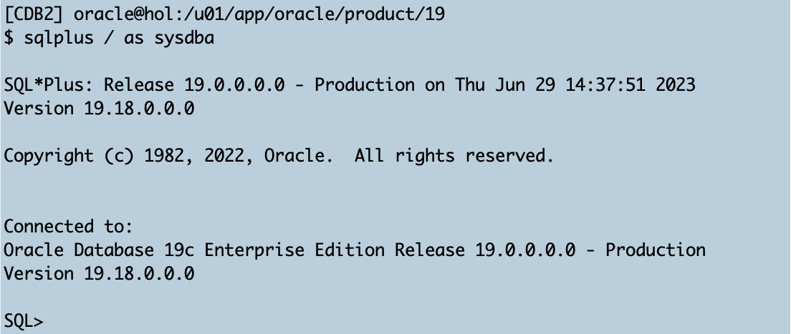
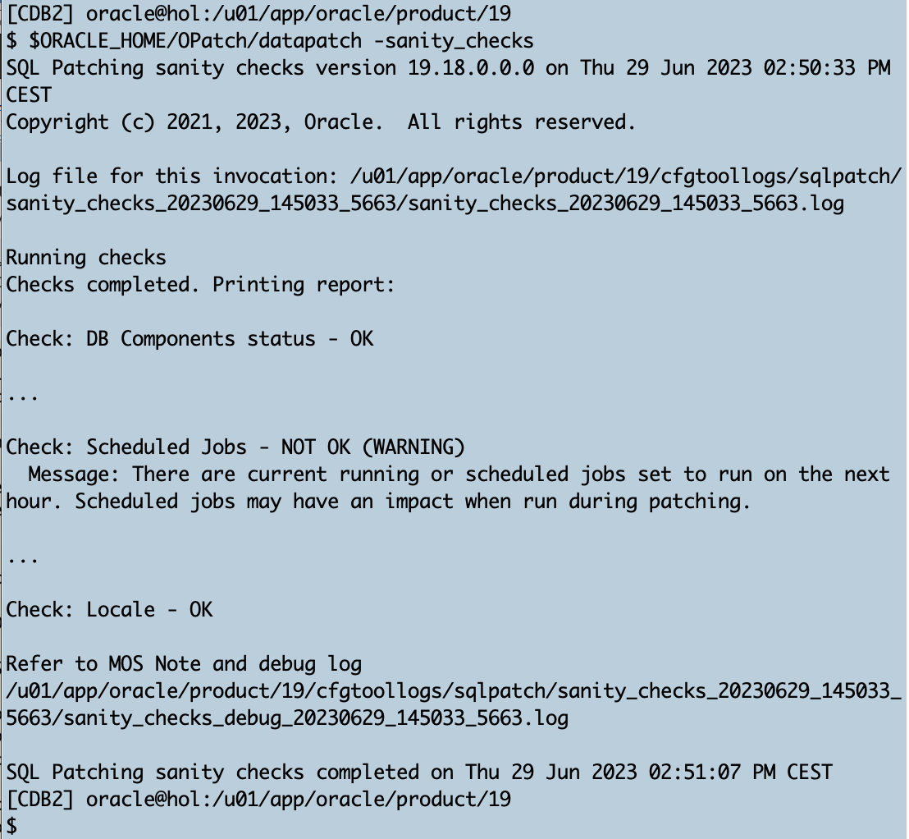
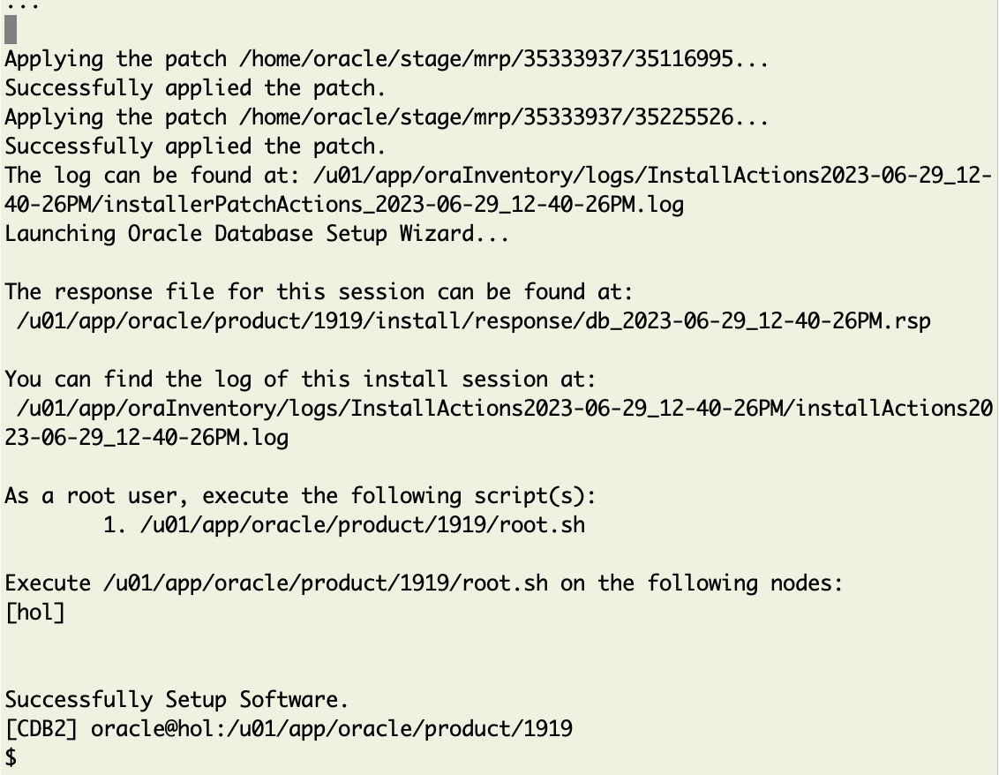
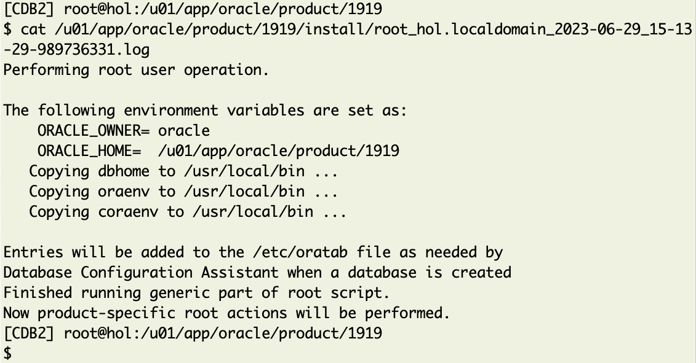

# Lab 3 - Checks in the 19.18 Environment

## Introduction 
We will use this lab to check several things in the source environment while the installation in the new environment progresses.

## Task 1 - Checks

### Step 1: Set the Source Database Environment

Switch to the other tab titled "19.18.0 Home" 

and set the environment.
  ```
    <copy>
    . cdb2
    </copy>
  ```
  

### Step 2: Current Installed Patches

Check the installed patches in the current 19.18.0 home:
 
  ```
    <copy>
    ./OPatch/opatch lspatches
    </copy>
  ```
  

<details>
 <summary>*click here to see the full opatch output*</summary>

  ``` text
[CDB2] oracle@hol:/u01/app/oracle/product/19
$ ./OPatch/opatch lspatches
35246710;HIGH DIRECT PATH READ AFTER 19.18 DBRU PATCHING
35213579;MERGE ON DATABASE RU 19.18.0.0.0 OF 35037877 35046819
35162446;NEED BEHAVIOR CHANGE TO BE SWITCHED OFF
35160800;GG IE FAILS WITH ORA-14400 AT SYSTEM.LOGMNRC_USER AFTER ORACLE DB UPGRADE TO 19.18DBRU
35156936;ORA-7445 [KFFBNEW()+351]  AFTER CONVERT TO ASM FLEX DISKGROUP
34974052;DIRECT NFS CONNECTION RESET MESSAGES
34879016;ALL SESSIONS HANG DUE TO INST_RCV BUFFER IS NOT GETTING WRITE PERMISSION
34871935;SBI  QUEUE BUILDUP - SESSIONS SPIKE WITH GC CURRENT REQUEST  (6-DEC-2022)
34861493;RESYNC CATALOG FAILED IN ZDLRA CATALOG AFTER PROTECTED DATABASE PATCHED TO 19.17
34810252;SPIN OFF FOR BUG 34808861 [ORA-00600  INTERNAL ERROR CODE, ARGUMENTS  [KFDS_GETSEGREUSEENQ01] TERMINATED ALL DB INSTANCES
34793099;STRESS FA CDB CREATION FAILS ON 19.17 WITH THE ORA-00704  BOOTSTRAP PROCESS FAILURE WHILE OPENING PDB$SEED
34783802;PARALLEL QUERY ON PARTITIONED TABLE RETURNS WRONG RESULT
34557500;CTWR CAUSED MULTIPLE INSTANCES IN HUNG STATE ON THE RAC STANDBY DATABASE
34340632;AQAH  SMART MONITORING &amp; RESILIENCY IN QUEUE KGL MEMORY USAGE
33973908;DBWR NOT PICKING UP WRITES FOR SOME TIME
32727143;TRANSACTION-LEVEL CONTENT ISOLATION FOR TRANSACTION-DURATION GLOBAL TEMPORARY TABLES
31222103;STRESS RAC ATPD FAN EVENTS ARE NOT GETTING PROCESSED WITH 21C GI AND 19.4 DB
34972375;DATAPUMP BUNDLE PATCH 19.18.0.0.0
34786990;OJVM RELEASE UPDATE: 19.18.0.0.230117 (34786990)
34765931;Database Release Update : 19.18.0.0.230117 (34765931)
29585399;OCW RELEASE UPDATE 19.3.0.0.0 (29585399)

OPatch succeeded.
[CDB2] oracle@hol:/u01/app/oracle/product/19
$
  ```
</details>

### Step 3: Current Java Version

Check the current JDK version:
  ```
    <copy>
     $ORACLE_HOME/jdk/bin/java -version
    </copy>
  ```
  


### Step 4: Current Perl Version

Check the current PERL version:
  ```
    <copy>
     $ORACLE_HOME/perl/bin/perl -version
    </copy>
  ```


<details>
 <summary>*click here to see the full perl output*</summary>

  ``` text
[CDB2] oracle@hol:/u01/app/oracle/product/19
$ $ORACLE_HOME/perl/bin/perl -version

This is perl 5, version 36, subversion 0 (v5.36.0) built for x86_64-linux-thread-multi

Copyright 1987-2022, Larry Wall

Perl may be copied only under the terms of either the Artistic License or the
GNU General Public License, which may be found in the Perl 5 source kit.

Complete documentation for Perl, including FAQ lists, should be found on
this system using "man perl" or "perldoc perl".  If you have access to the
Internet, point your browser at https://www.perl.org/, the Perl Home Page.

[CDB2] oracle@hol:/u01/app/oracle/product/19
$
  ```
</details>

Take notice of the current version "__This is perl 5, version 36, subversion 0 (v5.36.0) built for x86_64-linux-thread-multi__". 
We will check afterwards whether the PERL version has been updated as well. </br>


### Step 5: Current Time Zone

Then check the current time zone version in the container database.
Open SQL*Plus:
  ```
    <copy>
     sqlplus / as sysdba
    </copy>
  ```


and execute the SQL:
  ```
    <copy>
     column VALUE$ format a8
     select VALUE$, CON_ID from containers(SYS.PROPS$) 
     where NAME='DST_PRIMARY_TT_VERSION' order by CON_ID;
     </copy>

     Hit ENTER/RETURN to execute ALL commands.
  ```

Currently, the database uses the default timezone version deployed with Oracle Database 19c.


Exit from SQL*Plus:
  ```
    <copy>
     exit
    </copy>
  ```


### Step 6: Datapatch Sanity Check

And finally, you will do a `datapatch` sanity check:

  ```
    <copy>
     $ORACLE_HOME/OPatch/datapatch -sanity_checks
    </copy>
  ```




<details>
 <summary>*click here to see the full datapatch sanity check output*</summary>

  ``` text
[CDB2] oracle@hol:/u01/app/oracle/product/19
$ $ORACLE_HOME/OPatch/datapatch -sanity_checks
SQL Patching sanity checks version 19.18.0.0.0 on Thu 29 Jun 2023 02:50:33 PM CEST
Copyright (c) 2021, 2023, Oracle.  All rights reserved.

Log file for this invocation: /u01/app/oracle/product/19/cfgtoollogs/sqlpatch/sanity_checks_20230629_145033_5663/sanity_checks_20230629_145033_5663.log

Running checks
Checks completed. Printing report:

Check: DB Components status - OK
Check: PDB Violations - OK
Check: System invalid objects - OK
Check: Tablespace Status - OK
Check: Backup jobs - OK
Check: Temp Datafile exists - OK
Check: Datapump running - OK
Check: Container status - OK
Check: Encryption wallet - OK
Check: Dictionary statistics gathering - OK
Check: Scheduled Jobs - NOT OK (WARNING)
  Message: There are current running or scheduled jobs set to run on the next hour. Scheduled jobs may have an impact when run during patching.
  CDB$ROOT:
    JOB_NAME,NEXT_RUN_DATE,SCHEMA_NAME,STATE
    CLEANUP_ONLINE_IND_BUILD,29-JUN-23 03.31.11.107160 PM +02:00,SYS,SCHEDULED
    CLEANUP_ONLINE_PMO,29-JUN-23 03.31.51.696187 PM +02:00,SYS,SCHEDULED
    CLEANUP_TAB_IOT_PMO,29-JUN-23 03.31.21.515067 PM +02:00,SYS,SCHEDULED
Check: Optim dictionary upgrade parameter - OK
Check: Queryable Inventory locks - OK
Check: Queryable Inventory package - OK
Check: Queryable Inventory external table - OK
Check: Imperva processes - OK
Check: Guardium processes - OK
Check: Locale - OK

Refer to MOS Note and debug log
/u01/app/oracle/product/19/cfgtoollogs/sqlpatch/sanity_checks_20230629_145033_5663/sanity_checks_debug_20230629_145033_5663.log

SQL Patching sanity checks completed on Thu 29 Jun 2023 02:51:07 PM CEST
[CDB2] oracle@hol:/u01/app/oracle/product/19
$
[CDB2] oracle@hol:/u01/app/oracle/product/19
$
  ```
</details>

Except for the scheduler warning, everything looks good.


## Task 2 - Finish the Patch Installation

At this point the patching installation should be completed. Switch to the tab titled "19.19.0 Home". You should see the following output:



<details>
 <summary>*click here to see the full runInstaller output*</summary>

  ``` text
[CDB2] oracle@hol:/u01/app/oracle/product/1919
$ ./runInstaller -applyRU /home/oracle/stage/ru/35042068  \
>  -applyOneOffs /home/oracle/stage/ojvm/35050341,/home/oracle/stage/dpbp/35261302,/home/oracle/stage/mrp/35333937/34340632,/home/oracle/stage/mrp/35333937/35012562,/home/oracle/stage/mrp/35333937/35037877,/home/oracle/stage/mrp/35333937/35116995,/home/oracle/stage/mrp/35333937/35225526 \
>    -silent -ignorePrereqFailure -waitforcompletion \
>     oracle.install.option=INSTALL_DB_SWONLY \
>     UNIX_GROUP_NAME=oinstall \
>     INVENTORY_LOCATION=/u01/app/oraInventory \
>     ORACLE_HOME=/u01/app/oracle/product/1919 \
>     ORACLE_BASE=/u01/app/oracle \
>     oracle.install.db.InstallEdition=EE \
>     oracle.install.db.OSDBA_GROUP=dba \
>     oracle.install.db.OSOPER_GROUP=dba \
>     oracle.install.db.OSBACKUPDBA_GROUP=dba \
>     oracle.install.db.OSDGDBA_GROUP=dba \
>     oracle.install.db.OSKMDBA_GROUP=dba \
>     oracle.install.db.OSRACDBA_GROUP=dba \
>     SECURITY_UPDATES_VIA_MYORACLESUPPORT=false \
>     DECLINE_SECURITY_UPDATES=true

Preparing the home to patch...
Applying the patch /home/oracle/stage/ru/35042068...
Successfully applied the patch.
Applying the patch /home/oracle/stage/ojvm/35050341...
Successfully applied the patch.
Applying the patch /home/oracle/stage/dpbp/35261302...
Successfully applied the patch.
Applying the patch /home/oracle/stage/mrp/35333937/34340632...
Successfully applied the patch.
Applying the patch /home/oracle/stage/mrp/35333937/35012562...
Successfully applied the patch.
Applying the patch /home/oracle/stage/mrp/35333937/35037877...
Successfully applied the patch.
Applying the patch /home/oracle/stage/mrp/35333937/35116995...
Successfully applied the patch.
Applying the patch /home/oracle/stage/mrp/35333937/35225526...
Successfully applied the patch.
The log can be found at: /u01/app/oraInventory/logs/InstallActions2023-06-29_12-40-26PM/installerPatchActions_2023-06-29_12-40-26PM.log
Launching Oracle Database Setup Wizard...

The response file for this session can be found at:
 /u01/app/oracle/product/1919/install/response/db_2023-06-29_12-40-26PM.rsp

You can find the log of this install session at:
 /u01/app/oraInventory/logs/InstallActions2023-06-29_12-40-26PM/installActions2023-06-29_12-40-26PM.log

As a root user, execute the following script(s):
	1. /u01/app/oracle/product/1919/root.sh

Execute /u01/app/oracle/product/1919/root.sh on the following nodes:
[hol]


Successfully Setup Software.
[CDB2] oracle@hol:/u01/app/oracle/product/1919
$
  ```
</details>

### Step 1: Logon as root

Logon as `root` and type the password `oracle`:
  ```
    <copy>
     su root
    </copy>
  ```


and enter:
  ```
    <copy>
     oracle
    </copy>
  ```
When you're logged in, you see:


You can see the command prompt changed to "__[CDB2] root@hol:/u01/app/oracle/product/1919__".

### Step 2: Execute root.sh

Then execute the root.sh script:
  ```
    <copy>
     /u01/app/oracle/product/1919/root.sh
    </copy>
  ```


<details>
 <summary>*click here to see the full root.sh output*</summary>

  ``` text
[CDB2] root@hol:/u01/app/oracle/product/1919
$ cat /u01/app/oracle/product/1919/install/root_hol.localdomain_2023-06-29_15-13-29-989736331.log
Performing root user operation.

The following environment variables are set as:
    ORACLE_OWNER= oracle
    ORACLE_HOME=  /u01/app/oracle/product/1919
   Copying dbhome to /usr/local/bin ...
   Copying oraenv to /usr/local/bin ...
   Copying coraenv to /usr/local/bin ...

Entries will be added to the /etc/oratab file as needed by
Database Configuration Assistant when a database is created
Finished running generic part of root script.
Now product-specific root actions will be performed.
[CDB2] root@hol:/u01/app/oracle/product/1919
$
  ```
</details>


### Step 3: Exit from root

Exit from the `root` user and confirm that you are `oracle` again:

  ```
    <copy>
     exit
    </copy>
  ```


The command prompt changes from __root@__ back to __oracle@__.

### Step 4: Check

Confirm that you are `oracle` again:

  ```
    <copy>
     whoami
    </copy>
  ```


You may now *proceed to the next lab*


## Acknowledgements
* **Author** - Mike Dietrich 
* **Contributors** Klaus Gronau, Daniel Overby Hansen  
* **Last Updated By/Date** - Klaus Gronau, June 2023