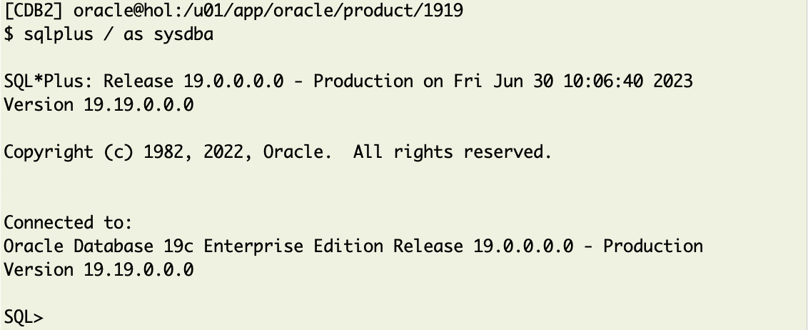

# Lab 6 - Cleanup Inventory and Final Checks

## Introduction 
You are done now. You did patch out-of place what we highly recommend, and you may have done also a more work-intense in-place patching exercise. So, let us check some things in the environment. 

Use the Oracle "__19.19.0 Home__" TAB of your terminal.


## Task 1 - Invalid Object Check

### Step 1: Open SQL*Plus

  ```
    <copy>
     sqlplus  / as sysdba 
    </copy>
  ```

  ```
    <copy>
    column value$ format a8
    select con_id, object_type, owner from CDB_OBJECTS where status='INVALID';
    </copy>

     Hit ENTER/RETURN to execute ALL commands.
  ```


There should be no invalid objects.

## Task 2 - Check Time Zone
The default time zone is DST V.32. But since the Release Update 19.18.0 all existing time zone files will be delivered. Please check if the automated patching with AutoUpgrade has updated the time zone. Remember, that the config file had upg1.timezone_upg=yes set intentionally:

  ```
    <copy>
     select VALUE$, CON_ID from containers(SYS.PROPS$) where NAME='DST_PRIMARY_TT_VERSION' order by CON_ID;
    </copy>
  ```


Remember that the version before upgrade was DST V.32 as you did check and verify in the previous labs. 

That is pretty awesome. Please be aware that AutoUpgrade by default will not adjust the time zone when you patch. But we set it intentionally, and the containers have been updated.


At this point, please `exit` SQL*Plus.
  ```
    <copy>
     exit
    </copy>
  ```


## Task 3 - Check JDK version
Please check whether the JDK version has been upgraded as well.

  ```
    <copy>
     /u01/app/oracle/product/1919/jdk/bin/java -version
    </copy>
  ```


This is intended. You will always get the n-1 version of JDK, i.e. the version which was current at the code freeze date for the content of the Release Update. If you need a newer JDK version, you please need to download and apply it afterwards. The version before patching was `java version "1.8.0_351"`.


## Task 4 - Check PERL version
Final check here is about whether PERL has been patched, too. The version before patching was v5.36.0).

  ```
    <copy>
     $ORACLE_HOME/perl/bin/perl -version
    </copy>
  ```


Now you see no difference. But PERL updates get delivered with Release Updates since January 2023. Hence, in this case, there was no update for 19.19.0.

## Task 5 - You are done!

Congratulations from the entire Oracle Database Upgrade, Migration and Patching team. You completed the Hands-On Lab "Patch me if you can" successfully. Next time, we'll approach the Grid Infrastructure patching together. 

But for now, relax - and thanks for taking the time to complete this lab.


## Acknowledgements
* **Author** - Mike Dietrich 
* **Contributors** Klaus Gronau, Daniel Overby Hansen  
* **Last Updated By/Date** - Klaus Gronau, June 2023