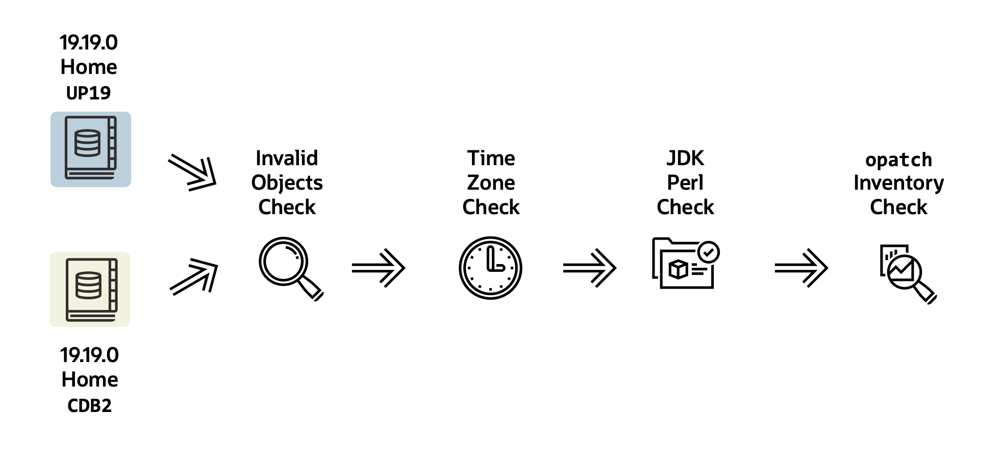
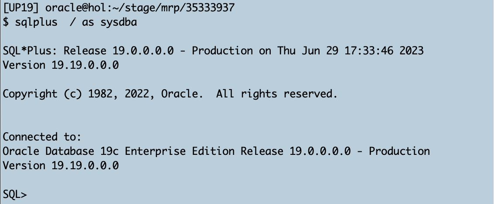
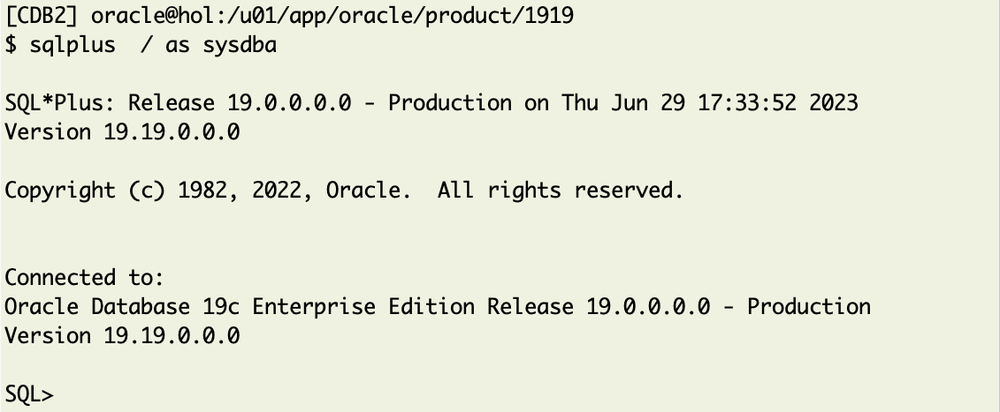
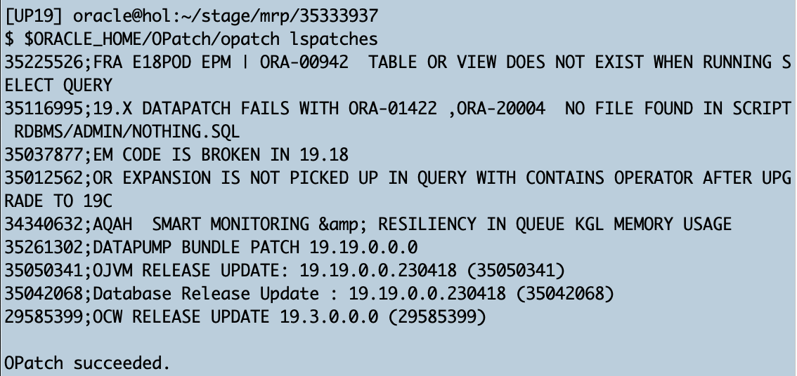
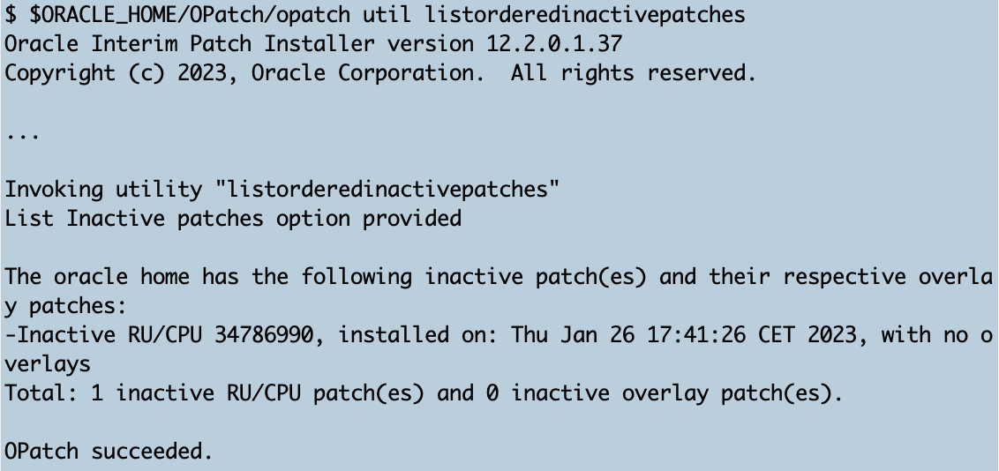
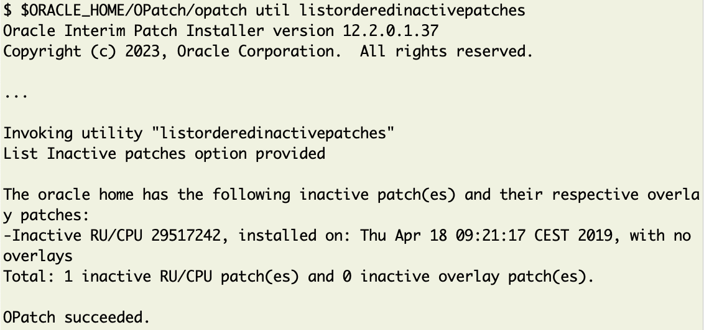

# Lab 6:  Final Checks

## Introduction 
You are done now. You did patch out-of place what we highly recommend, and you may have done also a more work-intense in-place patching exercise. So, let us check some things in both environment. 



Estimated Time: 10 minutes

### Objectives

Final Checks in both patched environments

### Prerequisites

This lab assumes you have:

- Connected to the lab
- Use the Oracle "__19.19.0 Home__" and "__19.18.0 Home__" TAB of your terminal.

| 19.18.0 Home | 19.19.0 Home |
| :------------: | :------------: |
|  |  |
{: title="19.18 and 19.19 Tab"}

## Task 1: Invalid Object Check

1. Start SQL*Plus </br>
Execute in 19.18 and 19.19 tab:

    ```
    <copy>
    sqlplus  / as sysdba 
    </copy> 
    ```

    | 19.18.0 Home | 19.19.0 Home |
    | :------------: | :------------: |
    |   |   |
    {: title="19.18 and 19.19 SQL*Plus "}


2. Check for Invalid Objects

    ```
      <copy>
      column value$ format a8
      select con_id, object_type, owner from CDB_OBJECTS where status='INVALID';
      </copy>

      Hit ENTER/RETURN to execute ALL commands.
    ```

    | 19.18.0 Home | 19.19.0 Home |
    | :------------: | :------------: |
    |   |   |
    {: title="19.18 and 19.19 Invalid objects "}
    

    There should be no invalid objects. </br>

    COMMENT: Even though the upgraded 19.18 database isn't a CDB/PDB you can use the same statement in both environments.

## Task 2: Check Time Zone Version

1. Latest available Time Zone Version
    ```
    <copy>
    SELECT dbms_dst.get_latest_timezone_version from dual;
    </copy>
    ```

    | 19.18.0 Home | 19.19.0 Home |
    | :------------: | :------------: |
    |   |   |
    {: title="19.18 and 19.19 Latest Available Time Zone Version"}

    Both updated databases have the latest available time zone version installed. But was this version also applied to the database?

2. Time Zone Version
    ```
    <copy>
    select VALUE$, CON_ID from containers(SYS.PROPS$) where NAME='DST_PRIMARY_TT_VERSION' order by CON_ID;
    </copy>
    ```

    | 19.18.0 Home | 19.19.0 Home |
    | :------------: | :------------: |
    |   |   |
    {: title="19.18 and 19.19 Time Zone Version"}

    There's a difference in the timezone version. The manually upgraded 19.18 Oracle\_Home database still shows the original 19.18 time zone version whereas the autoupgraded shows the current version.
    The reason for this difference is you only applied patches to 19.18 environment and executed datapatch. This does __NOT__ update your timezone version. </br>
    In the autoupgrade config file we specified "upg1.timezone_upg=yes" which upgraded the timezone version automatically for all containers to the latest available version. </br>
    So just in case you would use named time zones in your database, you now have to manually upgrade the time zone version in the 19.18 env. A good MOS note to start with is the next step for your manually upgraded database would be a manual timezone upgrade as described in [MOS note 	Applying the DSTv42 update for the Oracle Database (Doc ID 2941491.1)](https://support.oracle.com/epmos/faces/DocumentDisplay?id=412160.1)

3. Exit SQL\*Plus </br>
    At this point, please `exit` SQL*Plus.
    ```
    <copy>
    exit
    </copy>
    ```

  | 19.18.0 Home | 19.19.0 Home |
  | :------------: | :------------: |
  |   |   |
  {: title="19.18 and 19.19 Exit SQL*Plus "}


## Task 3: Check JDK version
Please check whether the JDK version has been upgraded as well.

  ```
    <copy>
     $ORACLE_HOME/jdk/bin/java -version
    </copy>
  ```

  | 19.18.0 Home | 19.19.0 Home |
  | :------------: | :------------: |
  |   |   |
  {: title="19.18 and 19.19 Java Version "}


This is intended. You will always get the n-1 version of JDK, i.e. the version which was current at the code freeze date for the content of the Release Update. If you need a newer JDK version, you please need to download and apply it afterwards. The version before patching was `java version "1.8.0_351"`.


## Task 4: Check PERL version
Now check if PERL has been patched, too. The version before patching was v5.36.0).

  ```
    <copy>
     $ORACLE_HOME/perl/bin/perl -version
    </copy>
  ```

  | 19.18.0 Home | 19.19.0 Home |
  | :------------: | :------------: |
  |  |   |
  {: title="19.18 and 19.19 Perl Version "}


Now you see no difference. But PERL updates get delivered with Release Updates since January 2023. Hence, in this case, there was no update for 19.19.0.


## Task 5: Opatch Checks
1. lspatches
    ```
    <copy>
    $ORACLE_HOME/OPatch/opatch lspatches
    </copy>
    ```

    | 19.18.0 Home | 19.19.0 Home |
    | :------------: | :------------: |
    |   |   |
    {: title="19.18 and 19.19 lspatches "}


2. listorderedinactivepatches

    ```
    <copy>
    $ORACLE_HOME/OPatch/opatch util listorderedinactivepatches
    </copy>
    ```

  | 19.18.0 Home | 19.19.0 Home |
  | :------------: | :------------: |
  |   |   |
  | Inactive RU/CPU 34786990 is a left over from the previous cleanup where you removed all inactive patches except of the last one | But what is "Inactive RU/CPU 29517242"?  Remember, you first unzipped/installed the 19.3.0.0 base release. This bug is just the tracker for the 19.3.0.0 code line.|
  {: title="19.18 and 19.19 listorderedinactivepatches "}


## Task 6: You are done!

Congratulations from the entire Oracle Database Upgrade, Migration and Patching team. You completed the Hands-On Lab "Patch me if you can" successfully. Next time, we'll approach the Grid Infrastructure patching together. 

But for now, relax - and thanks for taking the time to complete this lab.


## Acknowledgements
* **Author** - Mike Dietrich 
* **Contributors** Klaus Gronau, Daniel Overby Hansen  
* **Last Updated By/Date** - Klaus Gronau, June 2023